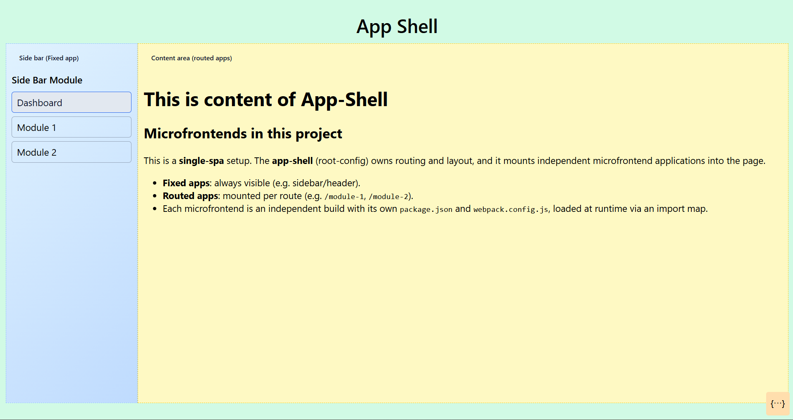

# SingleSPA Microfrontend Project



This repo contains a single-spa app shell plus three React microfrontend modules:

- `app-shell` (root-config, layout + routes)
- `nav-bar` (fixed application in sidebar)
- `module-1` (routed app)
- `module-2` (routed app)

## Prerequisites

- Node.js 25.2.1 ([Download](https://nodejs.org/dist/v25.2.1/node-v25.2.1-win-x64.zip))
- npm or yarn
- Windows PowerShell (commands below use PowerShell)

## Install Dependencies

Install each package independently:

```powershell
# From the repo root
cd app-shell; npm install; cd ..
cd nav-bar;  npm install; cd ..
cd module-1; npm install; cd ..
cd module-2; npm install; cd ..
```

## Start in Development

Run each dev server in its own terminal:

```powershell
# Terminal 1 (root-config)
cd app-shell
npm run dev  # serves on http://localhost:9000

# Terminal 2 (nav-bar) standalone mode
cd nav-bar
npm run dsa  # serves on http://localhost:8080

# Terminal 3 (module-1) standalone mode
cd module-1
npm run dsa  # serves on http://localhost:9001

# Terminal 4 (module-2) standalone mode
cd module-2
npm run dsa  # serves on http://localhost:9002
```

Open the shell at:

- http://localhost:9000

Routes available within the shell:

- `/dashboard` → dashboard view (default)
- `/module-1` → loads `@POC/module-1`
- `/module-2` → loads `@POC/module-2`

The app shell injects local import maps when started with `npm run dev`, mapping each microfrontend name to its dev server URL.

## Module's start mode: Default vs Standalone

**Default Mode (integrated via shell):**

- Purpose: integrate and test routing, layout, and cross-app behavior inside the shell.
- Command: run `npm run dev` for each microfrontend so the shell consumes their JS bundles via the import map.
- Where to browse: open the shell at http://localhost:9000 and navigate to `/module-1`, `/module-2`.
- Output: serves only the JS bundles (no standalone HTML page) for `@POC/nav-bar`, `@POC/module-1`, and `@POC/module-2` at the configured ports.
- Bundle size: smaller; framework libs like `react`, `react-dom`, `react-router-dom` are externalized and provided by the app shell via import maps/CDN.

**Standalone Mode (isolate a single app):**

- Purpose: develop and debug one microfrontend in isolation without the shell.
- Command: run `npm run dsa` inside the microfrontend (e.g., `nav-bar`, `module-1`, or `module-2`).
- Where to browse: open the microfrontend directly at its port (nav-bar: http://localhost:8080, module-1: http://localhost:9001, module-2: http://localhost:9002).
- Output: serves both the JS bundle and a standalone HTML page that mounts the app on its own.
- Bundle size: larger; includes framework/runtime libraries within the app's build.

**Which to use when:**

- Use Default Mode when validating shell integration, routes, and improve loading speed.
- Use Standalone Mode when you want to start and develop app alone.
- You can run Standalone Mode and the shell concurrently; the shell will still fetch the JS bundles from the same ports.

## Notes

- The app shell uses `single-spa-layout` with routes defined in `microfrontend-layout.html`, and injects `dashboard-view.html` at runtime within `POC-root-config.ts`.
- Import maps in development are injected by `index.ejs` when `--env isLocal` is used.
